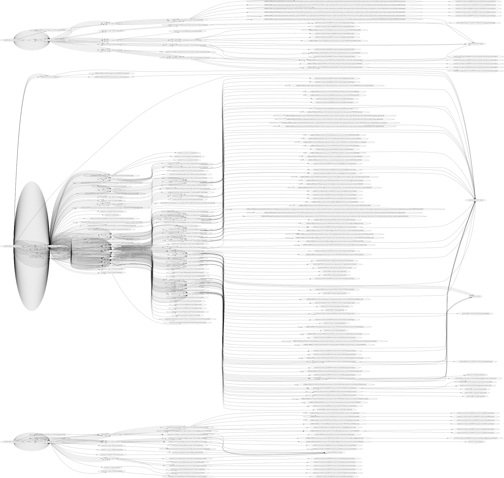
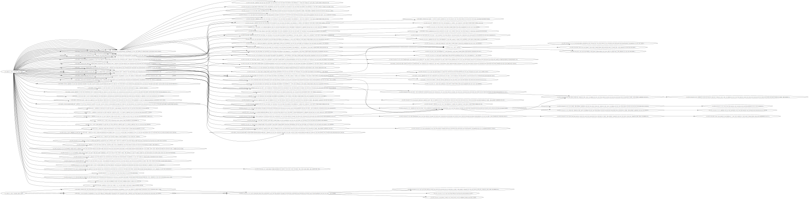

# Browserker

An open source web application scanner built for 2020, meant for SPAs and CI/CD automation not pen-testing.

## Running Quick Tips:

- Start a scan: `go build ; .\browserker.exe crawl --config .\configs\juiceshop.toml --dot juiceshop.dot --profile *> debug.log`
- List NavIDs: `go build ; .\browserker.exe replay --config .\configs\juiceshop.toml --list`
- Replay a NavID: `go build ; .\browserker.exe replay --config .\configs\juiceshop.toml --navID {hash}`
- Export DOT file: `go build ; .\browserker.exe replay --config .\configs\juiceshop.toml --list --dot juiceshop.dot`

Just run `./browserker --help` or `./browserker <cmd> --help` for more details on switches. Note --profile will start a webserver on http://localhost:6060/debug/pprof where you can inspect go routines / memory allocations take cpu snapshots etc.

### Config

Check out configs/ for example configuration files for running browserker with custom settings.

```
URL = "http://localhost:3000/#/login"
AllowedHosts = ["localhost"]
DataPath = "browserktmp"
DisableHeadless = true
NumBrowsers = 10
MaxDepth = 25
JSPluginPath = "plugins/"

[FormData]
UserName  = "test@test.com"
Email = "test@test.com"
Password = "testtest"
```

You can override all of the default FormData fields with whatever you think fits best. See [browserk/config.go](browserk/config.go) for options/defaults.

## Features / Goals

- A proxy-less scanner, based entirely off injecting and instrumenting chromium via the dev tools protocol.
  - If chromium removes specific interception features, plans are in place to create a custom chromium build.
- Allows for plugins to be written in Go or JS
- Allows plugins to be notified of various browser events:
  - Network requests
  - Network responses
  - Browser storage events
- Allows plugins to register hooks in to each of the above
- Allows plugins to inject javascript before and after a page loads
- Allows plugins full access to the browser
- Uses a custom graph to replay navigation paths so your attacks will work on complex page flows
- Custom crawler that will understand newer JS frameworks (VueJS, React, Angular and others)
- Custom scan types (import OpenAPI specs, GraphQL schemas) and attack outside the browser but use the same attack graph/engine

## Graphs!

As of 2020-07-08 this is what it is able to crawl from WebGoat and JuiceShop.

### WebGoat Crawl Graph



### JuiceShop Crawl Graph


